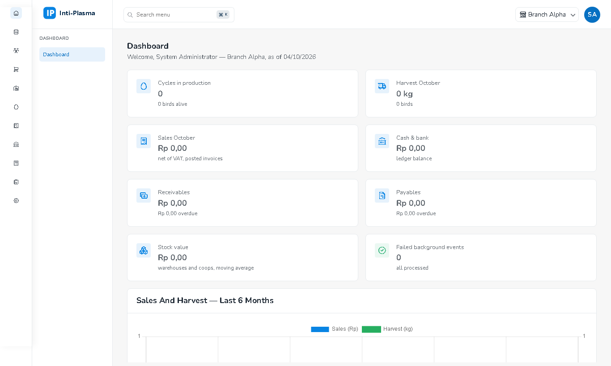

# 1. Login & Navigasi

## Masuk
1. Buka alamat aplikasi, isi **Email** dan **Password**, klik **Sign In**. Centang **Remember me** bila ingin tetap masuk setelah browser ditutup.
2. Pesan yang mungkin muncul:
   - *The email or password is incorrect* — email/password salah.
   - *The account is locked … Try again in N minute(s)* — sudah **5 kali** salah password berturut-turut; akun terkunci **15 menit**. Tunggu, atau minta admin menekan **Unlock** (Administration → Users). Reset password oleh admin juga membuka kunci.
   - *Too many attempts* — terlalu banyak percobaan login dari perangkat yang sama dalam satu menit; tunggu satu menit.
   - *The user account is inactive* / *No menu access has been assigned* — hubungi admin.

## Mainboard

- **Sidebar kiri**: kolom ikon = modul (Dashboard, Master Data, Partnership, Procurement, Inventory, Production, Sales, Finance, Costing, Reports, Administration); kolom kanan = menu modul tersebut. Hanya menu yang boleh Anda lihat yang tampil.
- **Search menu** (atau `Ctrl+K`): ketik nama menu, tekan Enter.
- **Cabang aktif** (kanan atas): menentukan filter default daftar dan nilai default form. Pilih *All Branches* untuk melihat semua cabang yang Anda punya aksesnya.
- Halaman tampil di area konten; alamat browser ikut berubah (`/#/Sales/SalesOrders`) sehingga bisa di-bookmark, di-refresh, dan tombol Back berfungsi.
- **Tablet**: sidebar tersembunyi; ketuk ikon ☰ di kiri atas untuk membukanya. Sidebar menutup otomatis setelah memilih menu.

## Sesi
- Sesi berakhir setelah **8 jam tanpa aktivitas**. Lima menit sebelumnya muncul jendela *Your session is about to expire* — klik **Stay signed in** untuk melanjutkan. Bila sesi habis, Anda dibawa ke halaman login dan kembali ke halaman semula setelah login.
- Sesi tetap berlaku walau server di-restart.

## Akun saya
- Menu avatar (kanan atas) → **Change Password**: isi password lama dan baru (min. 8 karakter). Sesi di perangkat lain akan berakhir dan login mobile harus diulang.
- **Sign Out** untuk keluar.
