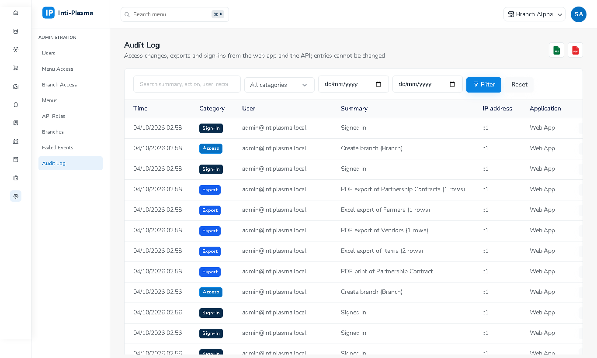

# 2. Administration

Menu **Administration** biasanya hanya untuk admin sistem.

## Menu Access (profil hak menu)
1. **Menu Access → Add**: isi nama & deskripsi, lalu centang matriks menu × **View / Create / Edit / Delete / Export** (centang per baris, per kolom, atau per grup). Hak selain *View* otomatis mewajibkan *View*; kotak untuk hak yang tidak didukung menu tidak ditampilkan.
2. **Duplicate** untuk membuat profil serupa. Profil sistem **Full Access** tidak bisa diubah/dihapus.
3. Profil yang masih dipakai user tidak bisa dihapus. Perubahan profil langsung berlaku untuk semua pemakainya (tanpa login ulang).

## Branch Access (profil cabang)
- **All branches** (termasuk cabang yang dibuat kemudian) atau pilih daftar cabang. Profil sistem **All Branches** tidak bisa diubah.
- User tanpa Branch Access tidak melihat data cabang mana pun.

## Users
- **Add User**: email, nama, password awal (min. 8), **Menu Access**, **Branch Access**, cabang default (harus termasuk Branch Access), dan opsional **API / Mobile access** (role untuk aplikasi mobile).
- Detail user: status, akses efektif, jumlah **Failed sign-ins**.
- Aksi (hak *Edit*): **Edit**, **Change Access**, **Deactivate/Activate**, **Reset Password**, **Unlock**; hak *Delete*: **Delete** (salinan cadangan disimpan).
- **Locked**: badge merah di daftar & detail (*Locked until …*) bila akun terkunci karena 5 kali salah password. **Unlock** membuka kunci seketika (Activate dan Reset Password juga membuka kunci).
- Tombol **Audit Log** di detail user menampilkan jejak audit user tersebut.

## Menus
Ubah nama tampilan, ikon, urutan dan aktif/nonaktif menu. Struktur & kode menu berasal dari aplikasi.

## API Roles
Role & permission untuk Web.Api/aplikasi mobile (format `modul:aksi`). Tidak memengaruhi menu web.

## Branches
Master cabang. Menonaktifkan cabang menghapusnya dari cabang efektif semua user.

## Failed Events
Event latar belakang (mis. jurnal otomatis, pembuatan gudang kandang) yang gagal setelah semua percobaan. Perbaiki penyebabnya dulu (biasanya mapping jurnal otomatis belum ada, atau tahun fiskal belum dibuka / periode sudah ditutup), lalu **Retry** atau **Retry All**. Event gagal memblokir tutup periode.

## Audit Log

Jejak yang tidak bisa diubah/dihapus:

| Kategori | Isi |
|---|---|
| **Access** | Perubahan user (buat, ubah, akses, role, aktif/nonaktif, reset password, unlock, hapus), profil Menu/Branch Access, menu, API role, cabang — dari web maupun API |
| **Export** | Setiap ekspor Excel/PDF/CSV dan cetak dokumen: menu, judul, jumlah baris, filter, cabang |
| **Sign-in** | Login berhasil, gagal, terkunci, ditolak (nonaktif / tanpa akses) — web maupun mobile |

Filter: pencarian, kategori, rentang tanggal. Klik ikon mata untuk detail (nilai perubahan dalam JSON; password selalu disamarkan `***`). Ekspor Excel/PDF dengan hak *Export*.
