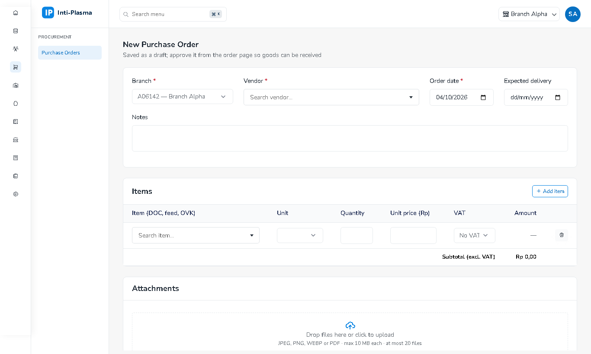

# 4. Procurement & Inventory

## Purchase Orders

1. **Add**: cabang, vendor, tanggal, baris item (satuan mengikuti item, qty, harga **tanpa PPN**, kode PPN). Total & PPN estimasi dihitung langsung.
2. *Draft* → **Approve** (nomor `PO/…`) → *PartiallyReceived/Received* saat barang diterima → **Close**. **Cancel** wajib alasan.
3. **Print PDF** untuk dikirim ke vendor.

## Goods Receipts (BPB)
- Dari PO yang sudah di-approve: sisa outstanding terisi otomatis; tidak boleh melebihi sisa PO.
- Pakan & OVK masuk **gudang induk**; **DOC boleh langsung ke gudang kandang** (masuk biaya siklus).
- Jurnal otomatis: Persediaan / Hutang Belum Ditagih. Kartu **Journal** di detail BPB menampilkan jurnalnya (bisa kosong beberapa detik).
- ⚠️ Pastikan **tahun fiskal sudah dibuka** (Finance → Fiscal Periods); bila belum, jurnal otomatis gagal dan muncul di Failed Events.

## Stock Transfers, Stock Returns, Feed Mutations
| Menu | Arah |
|---|---|
| **Stock Transfers** | Gudang induk → induk lain / gudang kandang (dibebankan ke siklus terbuka) |
| **Stock Returns** | Gudang kandang → gudang induk |
| **Feed Mutations** | Kandang A → gudang induk → kandang B dalam satu dokumen |

Transfer langsung kandang → kandang tidak diperbolehkan. Item yang bisa dipilih hanya yang ada stoknya di gudang asal (*on hand*).

## Stock Balance & Card
Saldo per gudang/item dengan nilai **moving average**; klik item untuk kartu stok (mutasi masuk/keluar). Stok tidak bisa minus. Ekspor Excel/PDF.
